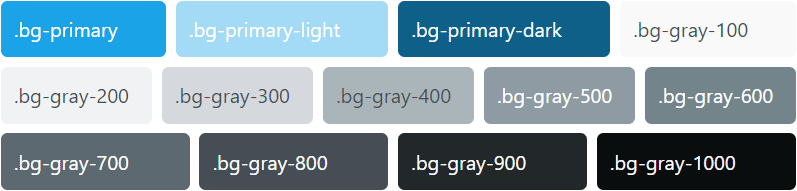

# Colors

We describe primary color using Hue, Saturation and Lightness. That hue component is for defining grays. Thanks to this all shades of gray will follow the primary color.

## CSS Variables

Basic design tokens are defined in <code>./settings/design-tokens.scss</code>.

```SCSS
  --g-color-blue-h: 200deg;
  --g-color-blue-s: 80%;
  --g-color-blue-l: 50%;
  ...
  --g-color-white: #fff;
  --g-color-black: #000;

```

Then we define **semantic** color variables in in <code>./settings/global.scss</code>

```SCSS
  // Primary
  --g-color-primary-h: var(--g-color-blue-h);
  --g-color-primary-s: var(--g-color-blue-s);
  --g-color-primary-l: var(--g-color-blue-l);
  --g-color-primary: hsl(var(--g-color-primary-h) var(--g-color-primary-s) var(--g-color-primary-l));
  --g-color-primary-light: hsl(var(--g-color-primary-h) var(--g-color-primary-s) 80%);

 // Grays
  --g-gray-h: var(--g-color-primary-h);
  --g-gray-s: 10%;
  --g-gray-100: hsl(var(--g-gray-h) var(--g-gray-s) 98%);
  --g-gray-200: hsl(var(--g-gray-h) var(--g-gray-s) 95%);

```

and a SCSS map:

```SCSS
$g-colors: (
  "primary": var(--g-color-primary),
  "primary-light": var(--g-color-primary-light),
  "primary-dark": var(--g-color-primary-dark),
  "gray-100": var(--g-gray-100),
  "gray-200": var(--g-gray-200),
  ...
);
```

## Generated classes

Based on above SCSS Map finally we generate classes for text, background and border color.
We use the format: <code>{property}-{color}-{scale}</code>.

| Class   | Property         |
| ------- | ---------------- |
| text-   | color            |
| bg-     | background-color |
| border- | border-color     |

**Examples**

```CSS
.text-primary {
  color: var(--g-color-primary) !important;
}

.bg-primary-light {
  background-color: var(--g-color-primary-light) !important;
}

.border-gray-500 {
  border-color: var(--g-gray-500) !important;
}


```

## Grays follow the primary

See how changing of one single value - primary color's hue component affect all shades of gray.


