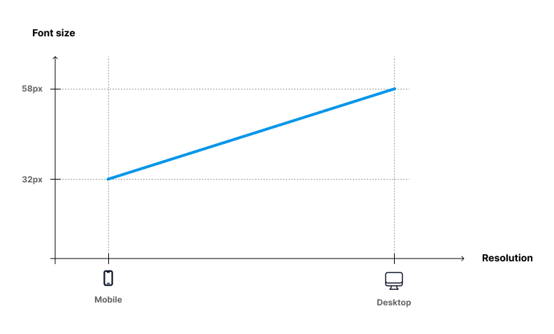

# Fluid layout

The most important things in User Interface are spacing and typography.<br/>
In Fluid UI those values changes relatively to viewport width without arbitrary breakpoints.
::: tip Fluid means that...
we can get rid of classical breakpoints such as <strong>xs, sm, md, lg, xl, xxl, 3xl, ... </strong>
:::

In our library we use <code>CSS clamp()</code> function to calculate all the values.

## Example:

Let's define font size with a CSS variable:

```CSS
--g-fs-1000: #{g-fluid(32px, 58px)};
```

That means that this font size will scale linear from 32px (on mobile) to 58px (desktop).



Below the compiled CSS for **--g-fs-1000** variable :

```CSS
--g-fs-1000: clamp(2rem, 2.65vw + 1.24rem, 3.63rem);
```

And finally based on that value we define a class:

```CSS
.fs-1000: var(--g-fs-1000);
```

And finally you will get a set of CSS utility classes ready to use for font size values, margins, paddings, gaps.

::: warning Better User Experience ..

<ul>
<li> In final CSS we use <strong>rem</strong> values, however there are <strong>px</strong> values <strong class="text-no-wrap">#{g-fluid(32px, 58px)} </strong> - it's easier to get the <strong>px</strong> values from the designs file (Figma etc.).</li>
<li>User accessibility - there is rem value inside the clamp() to support zooming</li>
</ul>
:::
